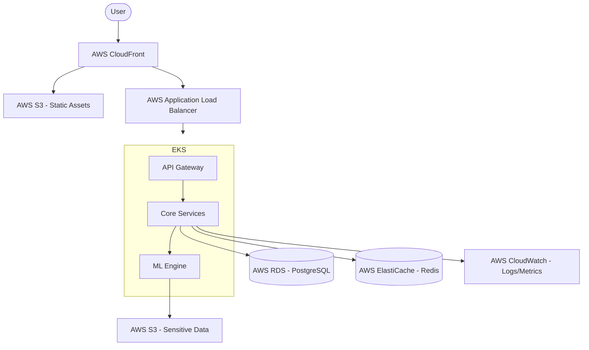
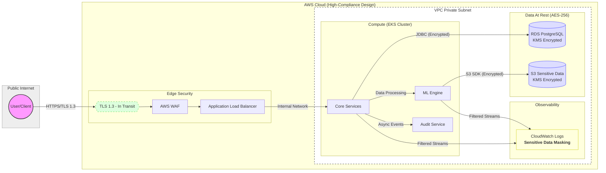

# GenovaX Platform

[](https://github.com/GenovaX/genovax-platform-infrastructure/actions/workflows/main.yml)
[](https://codecov.io/gh/GenovaX/genovax-platform-infrastructure)
[](https://github.com/GenovaX/genovax-platform-infrastructure/actions/workflows/terraform-security.yml)
[](https://www.checkov.io/)
[](https://github.com/terraform-linters/tflint)

**GenovaX** is a highly scalable, modern platform designed for medical technology, bioinformatics, and other **regulated environments** with **strict compliance requirements**.

> [!IMPORTANT]
> This repository focuses on **Infrastructure-as-Code (IaC)** and **platform governance**. Application source code is decoupled and managed in separate repositories. The platform provides reference Docker configurations for Spring Boot and ML services to demonstrate deployment readiness.

---

## 📋 Table of Contents
- [🏗 Architecture Overview](#-architecture-overview)
- [🎯 Design Philosophy](#-design-philosophy)
- [🛡 Data Flow & Sensitive Data Handling](#-data-flow--sensitive-data-handling)
- [💻 Tech Stack](#-tech-stack)
- [⚖️ Compliance & Security Controls Mapping](#-compliance--security-controls-mapping)
- [🚀 Production Readiness](#-production-readiness)
- [🛠 Prerequisites](#-prerequisites)
- [🚀 Quick Start & Environment](#-quick-start--environment)
- [📦 Deployment & Database Migrations](#-deployment--database-migrations)
- [📊 Monitoring & Observability](#-monitoring--observability)
- [☁️ Infrastructure Deployment](#-infrastructure-deployment)
- [🧪 Testing](#-testing)
- [📂 Repository Structure](#-repository-structure)
- [🔄 CI/CD & Deployment](#-cicd--deployment)
- [📖 Internal Documentation](#-internal-documentation)
- [🆘 Troubleshooting & Support](#-troubleshooting--support)
- [⚖️ License](#-license)

---

### 🏗 Architecture Overview

The platform is designed with High Availability and strict data security requirements in mind.

> [!NOTE]
> This repository contains the core platform infrastructure (IaC) and a reference implementation of a high-security application to demonstrate end-to-end integration in regulated environments.



*   **Infrastructure:** Fully automated deployment via Terraform on AWS (EKS, RDS, S3).
*   **Data Security:** Isolated environments, encryption at rest/transit, and automated audit trails.
*   **Reference Assets:** Dockerfiles and Helm charts for standard MedTech service stacks.

[**🔗 View Detailed Architecture Diagram**](./infrastructure/docs/architecture/Architecture.png) | [**🛡 View Threat Model**](./infrastructure/docs/security/threat-model.md)

---

### 🎯 Design Philosophy
- **Goals:** Compliance-aligned technical controls (encryption, audit, integrity), Least Privilege (IAM/IRSA), Infrastructure-as-Code (100% automation), Private-first networking.
- **Non-Goals:** Legal/Compliance attestation (this is a technical framework, not a legal certificate), organization-level policy management (BAA, etc.).

---

### 🛡 Data Flow & Sensitive Data Handling

The platform ensures data protection through strict flow management, multi-layered encryption, and automated sensitive data masking.

#### Data Flow Diagram (DFD)



#### Security Controls Matrix
*   **In Transit:** All communications use **TLS 1.3**. Network security is enforced via Security Groups and Network ACLs at the VPC level.
*   **At Rest:** Data in RDS and S3 is encrypted using **AES-256** via **AWS KMS** customer-managed keys (CMK).
*   **Masking:** CloudWatch Log Subscription Filters automatically detect and mask sensitive data patterns (PII) before logs are stored.
*   **Audit:** Every access to sensitive data is captured by the `compliance-audit` module and stored in immutable S3 buckets.

---

### ⚖️ Compliance & Security Controls Mapping

| Control | Implementation | Evidence (Code Path) |
| :--- | :--- | :--- |
| **Audit Immutability** | S3 Object Lock (Compliance mode) | [`infrastructure/terraform/global/audit.tf`](./infrastructure/terraform/global/audit.tf) |
| **Encryption at Rest** | KMS CMK with auto-rotation | [`infrastructure/terraform/modules/kms/`](./infrastructure/terraform/modules/kms/) |
| **Least Privilege Access** | IAM Roles for Service Accounts (IRSA) | [`infrastructure/terraform/modules/iam_roles_irsa/`](./infrastructure/terraform/modules/iam_roles_irsa/) |
| **Network Isolation** | Private Subnets & Network Policies | [`infrastructure/k8s/manifests/network-policies.yaml`](./infrastructure/k8s/manifests/network-policies.yaml) |
| **State Security** | Encrypted S3 Backend with Locking | [`infrastructure/terraform/global/s3-backend.tf`](./infrastructure/terraform/global/s3-backend.tf) |
| **Cost Governance** | AWS Budgets & Alerts | [`infrastructure/terraform/global/budgets.tf`](./infrastructure/terraform/global/budgets.tf) |
| **Disaster Recovery** | Cross-Region Replication & Backups | [`DR_STRATEGY.md`](./DR_STRATEGY.md) |

---

### 🚀 Production Readiness
- **RTO / RPO:** Target RPO < 15 min (RDS Cross-region snapshots), RTO < 4 hours.
- **High Availability:** Multi-AZ deployment for RDS and EKS worker nodes (across 3 Availability Zones).
- **Backups:** AWS Backup policy with 35-day retention and Vault Lock enabled to prevent accidental deletion.

---

### 💻 Tech Stack

| Layer              | Technologies                                                        |
|:-------------------|:--------------------------------------------------------------------|
| **Infrastructure** | Terraform 1.5+, AWS (EKS, RDS, S3, KMS)                             |
| **Containerization**| Docker, Helm 3                                                     |
| **Security/Scan**   | Checkov, TFLint, OPA (Rego)                                        |
| **Database**       | PostgreSQL 15, Redis                                                |
| **Monitoring**     | Prometheus, Grafana, AWS CloudWatch                                 |

---

### 🛠 Prerequisites

Before you begin, ensure you have the following installed:
*   **Terraform 1.5+**
*   **AWS CLI** (configured with appropriate credentials)
*   **Docker & Docker Compose**
*   **Make** (for using the provided Makefile)

---

### 🚀 Quick Start & Environment

#### 🛠 Management Interface (Makefile)
The project includes a `Makefile` to standardize common operations:
```bash
make help        # Show available commands
make setup       # Initialize local environment
make plan ENV=dev # Run Terraform plan
make scan        # Run security scans (Checkov/TFLint)
```

#### 🐳 Local Infrastructure (Docker)
Start local AWS emulation (LocalStack) and databases for testing:
```bash
docker-compose up -d
```

---

### 📦 Deployment & Database Migrations

#### 🔑 Secrets Management
In production environments, sensitive data is never stored in environment variables directly. We use **AWS Secrets Manager**. Terraform configures **IRSA** to allow EKS pods to securely retrieve secrets at runtime.

#### 🗄 Database Migrations
We use **Flyway** for version-controlled database schema evolution.
*   Migrations run automatically on application startup (controlled by Spring profiles).
*   In CI/CD, migrations are validated against a staging environment before being applied to production.

---

### 📊 Monitoring & Observability
*   **Metrics:** **Prometheus** scrapes JVM and HTTP metrics, visualized in **Grafana** dashboards.
*   **Logging:** Centralized aggregation in **AWS CloudWatch Logs** with automatic sensitive data masking.
*   **Tracing:** **AWS X-Ray** provides end-to-end request tracing across services.
*   **Health Checks:** Real-time status available at `host:port/actuator/health`.

---

### 📂 Repository Structure

```text
.
├── .github/workflows/      # CI/CD pipelines (Security scans, Terraform)
├── infrastructure/
│   ├── terraform/
│   │   ├── environments/   # Environment-specific values (dev, prod, local)
│   │   ├── global/         # Shared resources (IAM, Budgets, S3 State)
│   │   └── modules/        # Reusable IaC components (EKS, RDS, VPC)
│   ├── docker/             # Reference Dockerfiles for App & ML services
│   ├── k8s/                # Kubernetes manifests and Helm charts
│   ├── scripts/            # Utility and automation scripts
│   └── docs/               # ADRs, Architecture, and Security docs
├── Makefile                # Unified entrypoint for platform management
├── CHANGELOG.md            # Release history
└── DR_STRATEGY.md          # Disaster Recovery Strategy
```

---

### 🔄 CI/CD & Deployment
1.  **CI:** Runs tests, linters, and security scans (Checkov, TFLint) on every Pull Request.
2.  **CD:** Automatically deploys to `staging` after merging into the `main` branch.
3.  **Production:** Deployment to production is performed manually after Approval via the CI/CD pipeline.

---

### 🚀 Future Scalability & Roadmap
*   **Multi-Account Strategy:** Migration to **AWS Organizations** to isolate environments.
*   **FinOps & Cost Optimization:** Implementation of **Spot Instances** and **AWS Compute Optimizer**.
*   **Service Mesh (Istio):** Adoption planned for advanced traffic management and pod-to-pod **mTLS**.

---

### 🆘 Troubleshooting & Support
1. **Port Conflicts:** Ensure port `5432` and `6379` are free.
2. **Logs Access:** Use `docker-compose logs` locally or **CloudWatch Log Groups** in AWS.
3. **AWS Permissions:** Ensure you have an active session (e.g., `aws sso login`).
4. **Questions:** Please open a **GitHub Issue** for technical queries and support.

---

### ⚖️ License
This project is **Proprietary**. All rights reserved by GenovaX Platform.