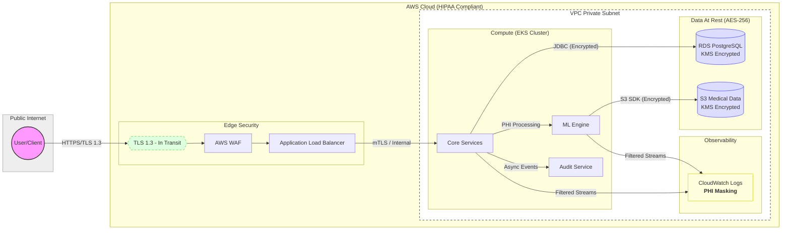

# GenovaX Platform

[](https://github.com/GenovaX/genovax-platform-infrastructure/actions/workflows/main.yml)
[](https://codecov.io/gh/GenovaX/genovax-platform-infrastructure)
[](https://github.com/GenovaX/genovax-platform-infrastructure/actions/workflows/terraform-security.yml)
[](https://www.checkov.io/)
[](https://github.com/terraform-linters/tflint)
[](https://adoptium.net/temurin/releases/?version=21)
[](https://nodejs.org/)

**GenovaX** is a highly scalable, modern platform for medical technology and bioinformatics.
The system integrates patient data management, compliance auditing, and research tools into a single secure ecosystem.

---

## 📋 Table of Contents
- [🏗 Architecture Overview](#-architecture-overview)
- [🛡 Data Flow & PHI Handling](#-data-flow--phi-handling)
- [💻 Tech Stack](#-tech-stack)
- [⚖️ Compliance & Security](#-compliance--security)
- [🛠 Prerequisites](#-prerequisites)
- [🚀 Quick Start & Environment](#-quick-start--environment)
- [📦 Deployment & Database Migrations](#-deployment--database-migrations)
- [📊 Monitoring & Observability](#-monitoring--observability)
- [☁️ Infrastructure Deployment](#-infrastructure-deployment)
- [🧪 Testing](#-testing)
- [📂 Repository Structure](#-repository-structure)
- [📖 API Documentation](#-api-documentation)
- [🔄 CI/CD & Deployment](#-cicd--deployment)
- [📖 Internal Documentation](#-internal-documentation)
- [🆘 Troubleshooting & Support](#-troubleshooting--support)
- [⚖️ License](#-license)

---

### 🏗 Architecture Overview

The platform is designed with High Availability and strict data security requirements in mind.


*   **Backend:** Microservices architecture based on Spring Boot 3.5.
*   **Frontend:** Monorepo using Next.js/React for various roles (Admin, Clinician, Patient).
*   **Infrastructure:** Fully automated deployment via Terraform on AWS (EKS, RDS, S3).
*   **Data:** Isolated PostgreSQL schemas to separate PII (Personally Identifiable Information) and system data (`iam`, `audit`, `patient_pii`).

[**🔗 View Detailed Architecture Diagram**](./infrastructure/docs/architecture/Architecture.png)

---

### 🛡 Data Flow & PHI Handling

The platform ensures HIPAA compliance through strict data flow management, multi-layered encryption, and automated PII/PHI masking.

#### Data Flow Diagram (DFD)



#### Security Controls Matrix
*   **In Transit:** All communications use **TLS 1.3**. Internal traffic between microservices is secured via **mTLS** (Istio/Service Mesh).
*   **At Rest:** Data in RDS and S3 is encrypted using **AES-256** via **AWS KMS** customer-managed keys (CMK).
*   **Masking:** CloudWatch Log Subscription Filters automatically detect and mask PHI/PII patterns before logs are stored.
*   **Audit:** Every access to PHI is captured by the `compliance-audit` module and stored in immutable S3 buckets.

---

### 💻 Tech Stack

| Layer              | Technologies                                                        |
|:-------------------|:--------------------------------------------------------------------|
| **Backend**        | Java 21 (Eclipse Temurin), Spring Boot 3.5, Spring Security, Flyway |
| **Frontend**       | Next.js 14, React, TypeScript, pnpm 9+, Tailwind CSS                |
| **Database**       | PostgreSQL 15, Redis (Caching)                                      |
| **Infrastructure** | Terraform 1.5+, AWS (EKS, RDS, S3, KMS), Docker                     |
| **ML Engine**      | Python 3.11, FastAPI, PyTorch                                       |
| **Monitoring**     | Prometheus, Grafana, AWS CloudWatch, AWS X-Ray                      |

---

### ⚖️ Compliance & Security

*   **HIPAA Ready:** Infrastructure complies with HIPAA requirements. All patient data is encrypted at rest (AES-256) and in transit (TLS 1.3).
*   **Access Control:** Strict access management via AWS IAM and an internal RBAC system.
*   **Security Scanning:** Automated IaC (Terraform) scanning using `Checkov` and `TFLint` in CI/CD pipelines.
*   **Audit Trail:** Full logging of all actions involving sensitive data through a dedicated audit module.

---

### 🛠 Prerequisites

Before you begin, ensure you have the following installed:

*   **Java 21** (**Eclipse Temurin** recommended)
*   **Node.js 20+** & **pnpm 9+**
*   **Docker & Docker Compose**
*   **Terraform 1.5+**
*   **AWS CLI** (configured with appropriate credentials)

---

### 🚀 Quick Start & Environment

#### 🔐 Environment Variables
Before running the services, create a local `.env` file based on the provided template:
```bash
cp .env.example .env
# Edit .env and provide your encryption keys and DB credentials
```

#### 🐳 Local Infrastructure (Docker)
Start the database and local AWS emulation (LocalStack):
```bash
docker-compose up -d
```

#### 🏃 Launching Services
```bash
./gradlew :app:bootRun        # Backend
cd frontend && pnpm dev       # Frontend
```

---

### 📦 Deployment & Database Migrations

#### 🔑 Secrets Management
In production environments, sensitive data (DB passwords, API keys) is never stored in environment variables directly. We use **AWS Secrets Manager**. Terraform configures **IAM Roles for Service Accounts (IRSA)** to allow EKS pods to securely retrieve secrets at runtime.

#### 🗄 Database Migrations
We use **Flyway** for version-controlled database schema evolution.
*   Migrations run automatically on application startup (controlled by Spring profiles).
*   Migration scripts are located in `app/src/main/resources/db/migration`.
*   In CI/CD, migrations are validated against a staging environment before being applied to production.

---

### 📊 Monitoring & Observability

To maintain 99.9% availability, the platform implements a comprehensive observability stack:

*   **Metrics:** **Prometheus** scrapes JVM, HTTP latency, and DB pool metrics, visualized in **Grafana** dashboards.
*   **Logging:** Centralized log aggregation in **AWS CloudWatch Logs**. Sensitive PII data is automatically masked using log filters.
*   **Tracing:** **AWS X-Ray** provides end-to-end request tracing across microservices and ML modules.
*   **Health Checks:** Real-time status available at `host:port/actuator/health`.

---

### ☁️ Infrastructure Deployment

> [!IMPORTANT]
> Always use CI/CD for Production deployments. Manual `terraform apply` is only recommended for `dev` and `sandbox` environments.

```bash
# Example for Dev environment
cd infrastructure/terraform/environments/dev
terraform init
terraform plan
terraform apply
```

---

### 🧪 Testing

We maintain a high standard of quality with automated tests across all layers.

#### 🖥 Backend (Unit & Integration)
```bash
./gradlew test
```

#### 🌐 Frontend (Unit & E2E)
```bash
cd frontend && pnpm test
```

#### 🛡 Infrastructure & Security (Static Analysis)
```bash
# Check Terraform security and best practices
checkov -d infrastructure/terraform
tflint --recursive
```

---

### 📂 Repository Structure

*   `CHANGELOG.md` — Release history and version management.
*   `infrastructure/` — Terraform modules, Kubernetes manifests, and technical documentation.
*   `DR_STRATEGY.md` — Disaster Recovery Strategy.

---

### 📖 API Documentation

The platform provides a comprehensive API documented with Swagger/OpenAPI.

*   **Local Access:** [http://localhost:8080/swagger-ui.html](http://localhost:8080/swagger-ui.html)
*   **Staging:** `https://api.staging.example.com/swagger-ui.html`
*   **Definition:** The OpenAPI JSON spec can be found at `/v3/api-docs`.

We use SpringDoc OpenAPI to automatically generate documentation from our controllers.

---

### 🔄 CI/CD & Deployment

The project utilizes GitHub Actions to automate the lifecycle:
1.  **CI:** Runs tests, linters, and security scans on every Pull Request.
2.  **CD:** Automatically deploys to `staging` after merging into the `main` branch.
3.  **Production:** Deployment to production is performed manually after Approval via the CI/CD pipeline.

---

### 📖 Internal Documentation

#### 🏗️ Architecture & Decisions
*   [Identity & Access Management](./infrastructure/docs/adr/ADR%20004:%20Identity%20and%20Access%20Management.md)
*   [Compliance & Audit System](./infrastructure/docs/adr/ADR%20006:%20Continuous%20Security%20Audit%20and%20Monitoring.md)
*   [Disaster Recovery Strategy](./DR_STRATEGY.md)

#### 🌍 Infrastructure & Environments
*   [Infrastructure Overview](./infrastructure/terraform/README.md)
*   [Global Resources](./infrastructure/terraform/global/README.md)
*   [Local Environment](./infrastructure/terraform/environments/local/README.md)
*   [Production Environment](./infrastructure/terraform/environments/prod/README.md)

#### 📦 Terraform Modules
*   [ACM (Certificate Manager)](./infrastructure/terraform/modules/acm/README.md)
*   [ALB (Application Load Balancer)](./infrastructure/terraform/modules/alb/README.md)
*   [AWS Backup](./infrastructure/terraform/modules/aws_backup/README.md)
*   [Cognito (Identity Provider)](./infrastructure/terraform/modules/cognito/README.md)
*   [ECR (Container Registry)](./infrastructure/terraform/modules/ecr/README.md)
*   [EKS (Kubernetes)](./infrastructure/terraform/modules/eks/README.md)
*   [IAM Roles for IRSA](./infrastructure/terraform/modules/iam_roles_irsa/README.md)
*   [KMS (Encryption Keys)](./infrastructure/terraform/modules/kms/README.md)
*   [Monitoring & Security](./infrastructure/terraform/modules/monitoring/README.md)
*   [RDS (PostgreSQL)](./infrastructure/terraform/modules/rds/README.md)
*   [S3 (Storage)](./infrastructure/terraform/modules/s3/README.md)
*   [VPC (Networking)](./infrastructure/terraform/modules/vpc/README.md)
*   [VPC Endpoints](./infrastructure/terraform/modules/vpc_endpoints/README.md)
*   [WAF (Web Application Firewall)](./infrastructure/terraform/modules/waf/README.md)

---

### 🆘 Troubleshooting & Support

1. **Port Conflicts:** Ensure port `5432` (PostgreSQL) and `6379` (Redis) are free before running Docker Compose.
2. **Logs Access:**
   - **Local:** Use `docker-compose logs -f [service_name]` for real-time logs.
   - **AWS:** Access logs in **CloudWatch Log Groups** under `/aws/eks/example-cluster/`.
3. **AWS Permissions:** If Terraform or CLI fails, ensure you have an active session (e.g., `aws sso login`) and the correct IAM permissions.
4. **Clean Start:** If local environment is corrupted, run `docker-compose down -v` to wipe volumes and start fresh.
5. **Questions:** Contact dev-support@example.com or open a GitHub Issue.

---

### ⚖️ License
This project is **Proprietary**. All rights reserved by GenovaX Platform. See [LICENSE](LICENSE) for details.
